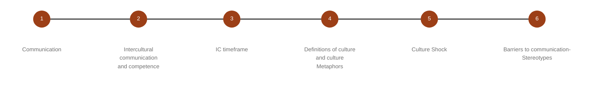

# Material

Slides are on moodle. Copyright needs to be figured out.

[Introduction-IC - ST.pdf](https://moodle.dhbw.de/mod/resource/view.php?id=364902)

[Block 1. Part 1.pdf](https://moodle.dhbw.de/mod/resource/view.php?id=364903)

## Introduction

We had to talk to each other. The outline out this course and how we are assesed was presented.

## Introduction

Why Do We Need to Learn About Other Cultures?

- To work Effectively in a Globalized World:
  - Most workplaces today are multicultural
- To provent miscommunication
  - Different cultures communicate differently
- To build stronger professional and personal relationships
  - People feel respected when others understand their cultural expectations
- To improve team performance
  - Research shows multicultural teams perform better - but only when members understand each other's cultural communication styles
- To Reduce Unconscious Bias
  - Many misunderstandings come from assumptions we don’t even realize we’re making.
- To Adapt to Diverse Customers and Clients
  - If you work with international or multicultural customers, understanding cultural expectations helps you:
    - communicate respectfully
    - customize services
    - increase satisfaction
    - avoid costly mistakes
- To Navigate Conflict More Effectively
  - Many conflicts are not about personality—they’re about cultural norms.
- To Develop Cultural Intelligence (CQ)
  - Training helps you build CQ by improving:
    - awareness
    - knowledge
    - empathy
    - behavioral flexibility

Goals of training IC

(As far as I understood, this is what we will be learning)

- Enhance Awareness
- Develop Cultural Competence
- Improve Communication Skills
- Build Empathy and Respect
- Reduce Misunderstandings and Conflict
- Facilitate Collaboration and Inclusivity
- Promote Adaptability and Flexibility

## Block 1

We were told to fill out what we know and what we want to lern in the first row of the [KWL Chart](./kwl.md).

The topics of the first block will be:

## Definition

> A process by which information is exchanged between individuals through a common system of symbols, signs, or behavior

Merriam-Webster Dictionary

---

Broader Definition

- Process by which people use verbal and nonverbal messages to create meaning in specific contexts, influenced by cultural norms, perceptions, and values.
- Communication is not merely the exchange of information but also a dynamic, symbolic, and contextual process that helps individuals and groups navigate relationships, understandings, and cultural differences.

Communication is.. 

- Dynamic: It is always changing
- Symbolic: Words, gestures and expressions
- Contextual: Depending on the situation and setting

Communication helps people to connect, build a relationship and understand one another

## Intercultural communication

> Creation, interpretation and understanding of meaning is different across cultures

- Culture is recognized as the product of human activities and history
- Culture is dynamic
- Culture contains enduring values/ideals

Goals:

- Increasing cultural awareness
- developing communication skills
- fostering empathy and open-mindedness
- improving problem-solving in multicultural settings
- preparing for global citizenship

Timeframe/Overview/Development

- **1940s-1950s – Beginnings**: Work of E.T. Hall and others
- **1960s** – IC is established as “normal science”
- **1970s**
  - IC courses start to proliferate.
  - The first doctorate in IC was given to William Starosta.
  - Journals of research (e.g. International and Intercultural Communication Annual) emerged
- **1980s** – IC theory was developed. William Gudykunst played an outstanding role in the theory of IC
- **1990s up to now**
  - Use and extension of the established theories and models to new areas (e.g. Japan and other nations)
  - criticism of the established theories and models

Competence/Awareness:

- Understanding one's own cultural worldview
- Recognizing and respecting cultural differences
- Developing skills to navigate interactions in ways that foster mutual understanding and positive relationships

- Being conscious of cultural dynamics, including values beliefs, behaviours, and communication styles
- Involves recognizing biases, avoiding ethnocentrism and cultivating empathy

## Milton Benett's model

Mentioned Milton Bennett’s Model of Intercultural Sensitivity (1998)

- It provides a theoretical framework
- It explains the stages people go through to gain intercultural competence

6 Stages:

- Ethnocentric Stages
  1. Denial
  2. Defense
  3. Minimization
- Ethno-relative Stages
  4. Acceptance
  5. Adaption
  6. Integration

Application/Usecases:

- Education and Training
- Self-Assessment and Growth
- Organizational Use

If you cultivate intercultural competence through awareness, reflection, and skill- building, Individuals and organizations can foster more meaningful connections in a diverse and interconnected world.

## Assignment / Group work

Research about the following questions online or with AI. Here is what the AI responded with:

> How to measure intercultural competence?

**A. Surveys and Questionnaires**

Surveys are one of the most common tools for measuring intercultural competence because they are efficient and standardized.

* They typically use **self-report scales** to assess attitudes (e.g., openness, curiosity), knowledge (e.g., cultural awareness), and skills (e.g., communication adaptability).
* Respondents rate statements such as *“I feel comfortable interacting with people from different cultural backgrounds”* on Likert scales.
* Well-known examples include:

  * Intercultural Development Inventory (IDI)
  * Cultural Intelligence Scale (CQS)
* **Strengths:** Easy to administer, allows comparison across individuals or groups.
* **Limitations:** May be influenced by self-perception bias or social desirability.

---

**B. Observations and Reflections**

This approach focuses on **actual behavior and personal meaning-making**.

* Instructors, trainers, or peers observe individuals during intercultural interactions (e.g., group work, simulations, international projects).
* Reflective journals, essays, or portfolios are used to analyze experiences and learning processes.
* Reflections often explore how individuals interpret cultural differences, manage misunderstandings, and adapt their behavior.
* **Strengths:** Captures real-life behavior and depth of learning.
* **Limitations:** Time-consuming and can be subjective without clear criteria.

---

**C. Competency Rubrics**

Rubrics provide **structured criteria** to assess intercultural competence across defined levels.

* They describe performance levels (e.g., beginner → developing → proficient → advanced).
* Common dimensions include:

  * Cultural self-awareness
  * Perspective-taking
  * Communication effectiveness
  * Ethical and respectful behavior
* Rubrics are often used to evaluate presentations, projects, or intercultural interactions.
* **Strengths:** Transparent expectations and consistent assessment.
* **Limitations:** Requires careful design to ensure validity and reliability.

---

**D. 360-Degree Feedback**

This method gathers feedback from **multiple perspectives**.

* Input is collected from peers, teachers, supervisors, and sometimes international partners.
* Feedback focuses on observable behaviors such as collaboration, respect, adaptability, and communication style.
* Comparing self-assessments with others’ feedback highlights gaps between intention and impact.
* **Strengths:** Holistic and balanced view of intercultural competence.
* **Limitations:** Depends on the cultural awareness and honesty of the evaluators.

---

> Explain the following tools to measure intercultural competence: [...]

**A. Intercultural Development Inventory (IDI)**

The **Intercultural Development Inventory (IDI)** is a validated psychometric assessment based on the **Developmental Model of Intercultural Sensitivity (DMIS)**.

* It measures how individuals perceive and respond to cultural differences.
* The IDI places individuals along a **developmental continuum** from monocultural to intercultural mindsets (e.g., Denial, Polarization, Minimization, Acceptance, Adaptation).
* Results compare a person’s **perceived orientation** with their **actual developmental orientation**, highlighting gaps in self-awareness.
* **Strengths:** Strong theoretical foundation; useful for education, training, and organizational development.
* **Limitations:** Requires certified administrators and can be costly.

---

**B. Cultural Intelligence Scale (CQ)**

The **Cultural Intelligence (CQ) Scale** measures a person’s capability to function effectively in culturally diverse settings.

* It is based on a **four-factor model**:

  * **Metacognitive CQ** (cultural awareness and strategy)
  * **Cognitive CQ** (cultural knowledge)
  * **Motivational CQ** (interest and confidence)
  * **Behavioral CQ** (ability to adapt behavior)
* The tool uses self-report questionnaires, sometimes combined with peer ratings.
* **Strengths:** Practical, widely used in business and leadership contexts.
* **Limitations:** Self-report nature may introduce bias.

---

**C. Global Competence Aptitude Assessment (GCAA)**

The **Global Competence Aptitude Assessment (GCAA)** evaluates intercultural effectiveness through **situational judgment and aptitude testing**.

* Instead of asking how competent people think they are, it measures how they **respond to real-life intercultural scenarios**.
* Focuses on dimensions such as:

  * Internal readiness (open-mindedness, resilience)
  * External effectiveness (relationship-building, communication)
* **Strengths:** Reduces self-report bias; focuses on applied competence.
* **Limitations:** Less reflective of attitudes or long-term development.

---

**D. Intercultural Readiness Check (IRC)**

The **Intercultural Readiness Check (IRC)** assesses how prepared individuals are for working and living in intercultural environments.

* It measures four core competences:

  * **Intercultural sensitivity**
  * **Communication**
  * **Building commitment**
  * **Managing uncertainty**
* The IRC provides practical feedback and development suggestions.
* Often used in **international mobility programs, global teams, and education**.
* **Strengths:** Action-oriented and development-focused.
* **Limitations:** Focuses more on readiness than deep cultural understanding.

---

**E. Behavioral Assessment Scale for Intercultural Competence (BASIC)**

The **Behavioral Assessment Scale for Intercultural Competence (BASIC)** focuses on **observable intercultural behaviors**.

* It evaluates skills such as:

  * Showing respect
  * Orientation to knowledge
  * Empathy
  * Task role behavior
  * Interaction management
* Assessment is typically done through **trained observers**, not self-report.
* **Strengths:** Emphasizes real behavior rather than perceptions.
* **Limitations:** Requires trained raters and structured observation contexts.

---

> Explain the 6 stages of intercultural sensitivity: [...]

1. **Denial:** Cultural differences are not recognized or are ignored.
2. **Defense:** One’s own culture is seen as superior; differences are viewed as a threat.
3. **Minimization:** Cultural differences are downplayed, and similarities are emphasized.
4. **Acceptance:** Cultural differences are recognized and respected as valid.
5. **Adaptation:** Individuals can adjust their behavior and communication to different cultural contexts.
6. **Integration:** Multiple cultural perspectives are internalized and used flexibly in daily life.

---

I think the scope of this course is mainly to reach stage 5. This includes the previous stages. In order to communicate effectively, it might be nessesary to adopt foreign traditions and habitats. Achieving stage 6 is likely impossible through a lecture. For that you'll probably need a lot of time and you probably should be (physically) in the place you want to integrate into.