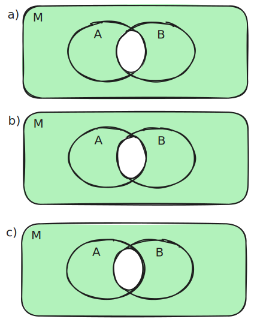
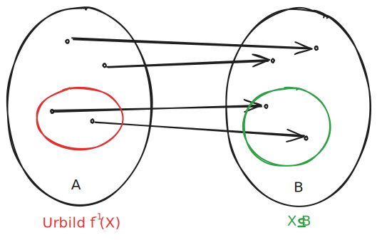
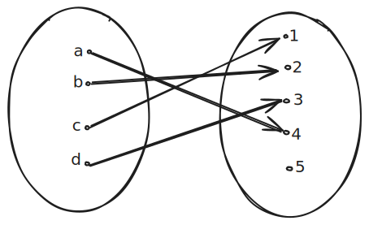
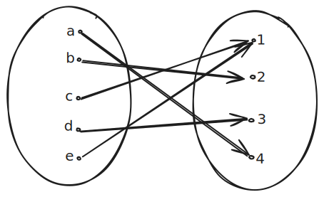
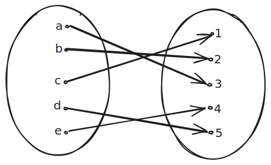
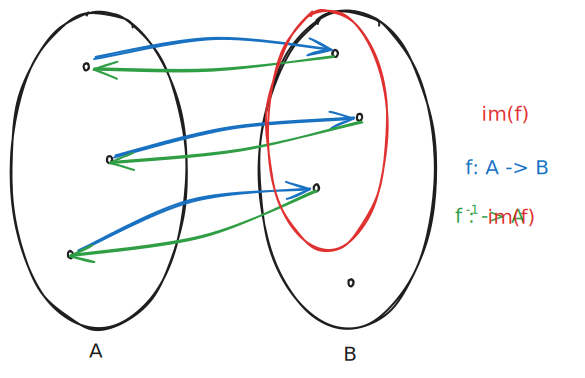

# Material

Abrufbar auf Moodle. Keine Veröffentlichung! Weitergabe gestattet.

[Kapitel3_Mengen.pdf](https://moodle.dhbw.de/mod/resource/view.php?id=364126)

[Kapitel4_Abbildungen.pdf](https://moodle.dhbw.de/mod/resource/view.php?id=365870)

## Mengen

Zur Wiederholung, eine Menge kann man folgendermaßen definieren:

1)

$C_a := \{ -3, -2, -1, 0, 1, 2, 3 \}$

$C_b := \{ x \in \mathbb{Z} | -3 \le x \lt 4 \}$

2)

$D_a := \{ -3, -2, -1, 0, 1, 2, 3 \}$

$D_b := \{ x \in \mathbb{R} | x^2 \le 9\}$

Wir haben Teilmengen, gleichheit von Mengen, leere Mengen und Kardinalität (Größe) von Mengen wiederholt.

**Schnittmenge**

$A \cap B$: Alle Elemente die in A und B vorhanden sind. Beispiel:

$A := \{ x \in \mathbb{R} | x \ge 0 \}$

$B := \{ x \in \mathbb{R} | x \lt 3 \}$

$A \cap B = \{ x \in \mathbb{R} | x \ge 0 \land x \lt 3 \} = [0;3)$

Beide Eigenschaften (von $A$ und $B$) müssen erfüllt sein.

**Vereinigung**

$A \cup B$: Alle elemente die in A oder B vorhanden sind. Beispiel:

$A := \{ x \in \mathbb{R} | -1 \le x \le 3\} = [-1; 3]$

$B := \{ x \in \mathbb{R} | 1 \lt x \lt 5\} = [1;5]$

$A \cup B = \{ x \in \mathbb{R} | (-1 \le x \le 3) \lor (\lt x \lt 5) \} = [-1;5]$

Eine Eigenschaft (von $A$ oder $B$) muss erfüllt sein.

**Differenz**

$A \setminus B$: Alle Elemente von $A$, die nicht in $B$ vorhanden sind. Beispiel:

$A := \{ x \in \mathbb{R} | -1 \le x \le 5\} = [-1; 5]$

$B := \{ x \in \mathbb{R} | 2 \lt x \lt 4\} = [2;4]$

$A \setminus B = \{ x \in \mathbb{R} | x \in A \land x \notin B \} = [-1;2 [\cup] 4;5]$

Die Eigenschaften von $A$ müssen erfüllt sein und die Eigenschaften von $B$ dürfen nicht erfüllt sein.

**Komplement**

$A^C := M \setminus A$: Die Menge $M$ ohne $A$. Zudem muss gelten $A \subseteq M$. Beispiel:

$M := \mathbb{R}$

$A := \{x \in \mathbb{R} | -1 \le x \le 2 \} = [-1;2]$

$A^C := M \setminus A = \{ x \ in \mathbb{R} | x \lt -1 \lor x \gt 2 \} = (-\infty, 1 [\cup] 2, \infty)$

**Symmetrische Differenz**

$A \triangle B := (A \cup B) \setminus (A \cap B)$: Enthält alle Elemente aus der Vereinigung von $A$ und $B$, aber nicht der Schnittmenge. Beispiel:

$A := \{ 1,2,3,4,5 \}$

$B := \{ 4,5,6,7 \}$

$A \triangle B := \{ 1,2,3,6,7 \}$

## Übung

(a) $A \cap D := \{ -1;2 \}$

(b) $A \setminus B := \{ -1;1 \}$

(c) $(A \setminus B) \cup (B \setminus A)$

(d) $A \setminus (C \cap B)$

**Graphische Darstellung von Mengen:**

**Venn Diagramme lesen**

(a) $(A \cap B)^C$

(b) $(A \setminus B)^C$

## Weitere Definitionen

> Sind $A$ und $B$ mengen mit $A \cap B = 0$, dann heißen $A$ und $B$ disjunkt

> Seien $A$ und $B$ mengen, dann gilt: $A \cap B \subseteq A,B \subseteq A \cup B$

> Sei $M$ eine Menge und $A \subseteq M$, dann gilt:
>
> - $(A^C)^C = A$
> - $A \cap M = A$
> - $A \cup M = M$

Seien $A$, $B$, $C$ Teilmengen eienr Grundmenge $M$, dann gelten folgende Gesetze:

1. $A \cup B = B \cup A$ Kommultativgesetz
2. $A \cap B = B \cap A$ Kommultativgesetz
3. $(A \cup B) \cup C = A \cup (B \cup C)$ Assoziativgesetz
4. $(A \cap B) \cap C = A \cap (B \cap C)$ Assoziativgesetz
5. $A \cap (A \cup B) = A$ Verschmelzungsgesetz / Absorptionsgesetz
6. $A \cup (A \cap B) = A$ Verschmelzungsgesetz / Absorptionsgesetz
7. $A \cup (B \cap C) = (A \cup B) \cap (A \cup C)$ Distributivgesetz
8. $A \cap (B \cup C) = (A \cap B) \cup (A \cap C)$ Distributivgesetz
9. $A \cap M = A$ und $A \cup M = M$ neutrale Elemente
10. $A \cap A^C = \emptyset$ und $A \cup A^C = M$ inverse Elemente

> $A$, $B$ und $C$ sind mengen aus $M$. Stellen Sie die folgenden Aussagen graphisch dar:

(a) $x \in (A \cap B)^C$
(b) $x \in A^C \cup B^C$
(c) $x \in A^C \lor x \in B^C$

## De Morganische Gesetze

Wenn $A,B \subseteq M$, dann gilt:

- $(A \cap B)^C = A^C \cup B^C$
- $(A \cup B)^C = A^C \cap B^C$

zuzeigen $(A \cap B)^C = A^C \cup B^C$ für $A,B \subseteq M$

$$
\begin{align*}
x \in (A \cup B)^C &\Leftrightarrow x \notin A \cup B &\text{(Def. Komplement.)} \\
&\Leftrightarrow \neg (x \in A \cap B) \\
&\Leftrightarrow \neg ((x \in A) \land (x \in B)) \\
&\Leftrightarrow \neg(x \in A) \lor \neg (x \in B) \\
&\Leftrightarrow x \in A^C \lor x \in B^c \\
&\Leftrightarrow x \in (A^C \cup B^C) &\text{(Def. Vereinigung)}
\end{align*}
$$

## Kartesisches Produkt

$A \times B$: Ist die Menge aller geordneten Paare von $A$ und $B$

Also alle möglichen Paare/Kombinationen dieser beiden Mengen

Mengen, wie z.B. $\mathbb{R^2}$ oder $\mathbb{R^3}$ sind Beispiele für solche kartesische Produkte.

Im Gegenteil zu Mengen macht die Reihenfolge der Elemente beim kartesischen Produkt einen Unterschied. 

## Potenzmengen

$P(M)$ ist die Menge aller Teilmengen dieser Menge. Beispiel:

$M = \{a,b\}$

$P(M) = \{\emptyset, \{a\}, \{b\}, \{a,b\}\}$

Für die Mächtigkeit einer solchen Menge gilt:

$\#P(M) = 2^{\#M}$

## Übung zu Potenzmengen

$A = \{0,1, (0,1)\}$

Ist (.) ein Element der Potenzmenge $P(A)$?

(a) $\emptyset$ : Ja
(b) $\{0\}$ : Ja
(c) $\{(0,1)\}$ : Ja
(d) $\{x \in \mathbb{R} | 0 \lt x \lt 1\}$ : Nein
(e) $\{0, (0,1)\}$ : Ja
(f) $\{0,2\}$ : Nein
(g) $\{0,1,(0,1)\}$ : Ja
(h) $\{\emptyset\}$ : Nein

# Kapitel 4 - Abbildungen

**Definition**

$A$ und $B$ sind Mengen. Eine Abbildung $f$ von $A$ nach $B$ ordnet jedem Element $a$ aus $A$ ein Element $b$ aus $B$ zu:

$f: A \rightarrow B, a \rightarrowtail f(a) = b$

$A$ ist der Definitionsbereich von $f$ und B ist der Wertebereich von $f$:

$im(f) := \{b \in B | \exists a \in A: f(a) = b \}$

Beispiel für eine Abbildung:

Eine Abbildung, die jeder reellen Zahl ihr Quadrat zuordnet:

$f: \mathbb{R} \rightarrow \mathbb{R}, x \rightarrowtail x^2$

Ist der Wertebereich und Definitionsbereich bereits aus dem Kontext heraus klar, kann man das auch als $f(x) = x^2$ schreiben.

**Identität**

Wenn $A$ eine Menge ist, dann ist die Identität von $A$ ($id_A$) die Abbildung von $A$.

**Einschränkung**

Nur ein Teil der Definitionsmenge (bestimmte $a$ aus $A$) werden auf $B$ abgebildet.

$f|x: X \rightarrow B, x \rightarrowtail f(x)$

**Graphen**

Wenn $A$ und $B$ Mengen sind und $f$ eine Abbildung $f: A \rightarrow B$, dann ist der Graph $graph(f)$.

$graph(f) := \{(a,b) \in A \times B | f(a) = b \} $

**Urbild**

Definition: Seien $A$ und $B$ Mengen, sei $X \subseteq B$ eine Teilmenge und sei $f:A \rightarrow B$ eine Abbildung. Das Urbild $f^{-1}(X)$ von $X$ unter $f$ ist die Menge:

$f{-1}(X) := \{a \in A | f(a) \in X\}$

Das Urbild einer Menger $X$ unter einer Abbildung $f$ besteht also aus all denjenigen Elementen aus dem Definitionsbereich, deren Bild unter $f$ in $X$ ligt.

Das Urbild ist eine Menge aller $x$, die auf $B$ abgebildet werden. Im Gegensatz zur inversen Abbildung handelt es sich um keine Funktion. Ein Urbild eine Abbildung existiert immer.

Beispiel: $f(x) = x^2$

Das Urbild $f^{-1}(x)$ ist also die Umkehrung:

- $f^{-1}(\{9\}) = \{3, -3\}$
- $f^{-1}(\{-4\}) = \emptyset$
- $f^{-1}(\{0\}) = \{0\}$

## Definitionen von Eigenschaften

**injektiv**

Eine Abbildung ist injektiv, wenn jedes Element im Wertebereich maximal ein Urbild hat:

$\forall x,y \in A: x \neq y \Rightarrow f(x) \neq f(y)$

$\forall b \in im(f) \exists_1a\in A: f(a) = b$

Alle Elemente im Wertebereich werden höchstens 1x getroffen

**surjektiv**

Bei einer surjektiven Abbildung entspricht das Bild der Abbildung dem Wertebereich. Ein
Element im Bild der Abbildung kann aber mehr als ein Urbild besitzen.

$im(f) = B$

Alle Elemente im Wertebereich werden mindestens 1x getroffen.

**bijektiv**

Bei einer bijektiven Abbildung hat jedes Element aus dem Wertebereich genau ein Urbild.

$\forall b \in B \exists_1a\in A: f(a) = b$

Alle Elemente im Wertebereich werden genau 1x getroffen

## Übung Abbildungen

> Sind folgende Abbildungen injektiv, surjektiv oder bijektiv?

1. injektiv
2. bijektiv
3. surjektiv (wenn $N_0$), ansonsten weder injektiv noch surjektiv
4. weder injektiv noch surjektiv
5. surjektiv

# Weiter Definitionen von Eigenschaften

**inverse Abbildung**

Wenn eine Abbildung zweier Mengen $f: A \rightarrow B$ ist, dann ist die inverse Abbildung $f^{-1}$ die funktion, die das wieder Rückgängig macht und alle $B$ zurück auf $A$ zeigt. Das funktioniert nur bei bijektiven Abbildungen.

$f{-1}: im(f) \rightarrow A, b \rightarrowtail a_b$

**Verknüpfungen**

Eine Verknüpfung auf einer Menge $A$ ist eine Abbildung, die zwei Elemente aus $A$ nimmt und ein Element aus $A$ zurückgibt. (ChatGPT)

Laut definition: $*: A\times A \rightarrow A$

Beispiele:

- $\color{pink}+:\color{green}\mathbb{R} \times \mathbb{R} \rightarrow \mathbb{R}, \color{lightblue}(x,y) \rightarrowtail x + y$
- $\color{pink}\cdot:\color{green}\mathbb{R} \times \mathbb{R} \rightarrow \mathbb{R}, \color{lightblue}(x,y) \rightarrowtail x \cdot y$

$\color{pink}+:$ Der Name der Verknüpfung. Genau wie $f$ bei einer Funktion. Bei abstrakten Verknüpfungen nimmt man $*$.

$\color{green}\mathbb{R} \times \mathbb{R} \rightarrow \mathbb{R}$ Typenangabe der Verknüpfung. In diesem Fall wird ein Paar $(a,b)$ (beide aus $\mathbb{R}$) zu einem Element aus $\mathbb{R}$.

$\color{lightblue}(x,y) \rightarrowtail x + y$ Definition der Verknüpfung. In diesem Fall wird jedes Tupel $(a,b)$ zu $a + b$.

**Verkettung von Abbildungen**

Seien $A$, $B$ und $C$ Mengen und seien $f: A \rightarrow B$ und $g: B \rightarrow C$ Abbildungen. Die Verkettung von $g \circ f$ von $f$ und $g$ ist definiert als:

$g \circ f: A \rightarrow C, x \rightarrowtail (g \circ f)(x) = g(f(x))$

Beispiel:

$f(x) = x^2$

$g(x) = x+1$

$f \circ g: (x+1)^2$

$g \circ f: x^2 + 1$

Für Verkettungen gilt Assoziativität

$((h \circ g) \circ f) = (h \circ (g \circ f))$

Das gilt, weil:

Mit Definition von $\circ$:

$(p \circ q)(x) = p(q(x))$

Dann lässt sich zeigen:

$$
\begin{align*}
((h \circ g) \circ f)(a) &= (h \circ g)(f(a)) \\
&= h(g(f(a)))
\end{align*}
$$

Seien $A$ und $B$ mengen und $f$ eine injektive Abbildung, dann gilt:

- $f^{-1} \circ f = id_A$ : Wenn man erst $f$ und dann $f^{-1}$ anwendet, bekommt man jedes Element aus $A$ genau zurück. (ChatGPT)
- $f \circ f^{-1} = id_{im(f)}$ : Wenn man zuerst die inverse Abbildung $f^{-1}$ und danach wieder $f$ anwendet, dann bleibt jedes Element aus dem Bild von $f$ unverändert. (ChatGPT)

**Gleichmächtigkeit von Mengen**

Zwei Mengen sind gleichmächtig, wenn es eine bijektive Abbildung gibt.

Die Menge der natürlichen Zahlen $\mathbb{N}$ und der gnazen Zahlen $\mathbb{Z}$ sind gleichmächtig.

Beweis oder so?:

Für ungerade Zahlen gilt:

$f(2n-1) = n - 1$:

$$
\begin{align*}
n = 1 : f(1) &= 0 \\
n = 2 : f(3) &= 1 \\
n = 3 : f(5) &= 2
\end{align*}
$$

Für gerade Zahlen gilt:

$f(2n) = -n$

$$
\begin{align*}
n = 1 : f(2) &= -1 \\
n = 2 : f(4) &= -2 
\end{align*}
$$

Aus dieser Abbildung ergibt sich die folgende Zuordnung:

| $K \in \mathbb{N}$    | 1   | 2   | 3   | 4   | 5   |
| --------------------- | --- | --- | --- | --- | --- |
| $f(k) \in \mathbb{Z}$ | 0   | -1  | 1   | -2  | 2   |

Deshalb ist diese Abbildung bijektiv, da jede Zahl in $\mathbb{Z}$ genau einmal getroffen wird.

Das gleiche gilt auch für die Menge der rationalen Zahlen $\mathbb{Q}$.

Das contorische Diagonalargument beschreibt diese Zuweisung von einer zur anderen Zahlenmenge:

Für $\mathbb{N} \rightarrow \mathbb{N}^2$

|     | 1         | 2         | 3   |
| --- | --------- | --------- | --- |
| 1   | (1,1) = 1 | (1,2) = 3 | 6   |
| 2   | (2,1) = 2 | 5         | ..  |
| 3   | 4         | ..        | ..  |

Für $\mathbb{Z} \times \mathbb{N} \rightarrow \mathbb{Q}$, durch $(a,b) \rightarrowtail \frac{a}{b}$. Daher auch gleichmächtig und surjektiv.