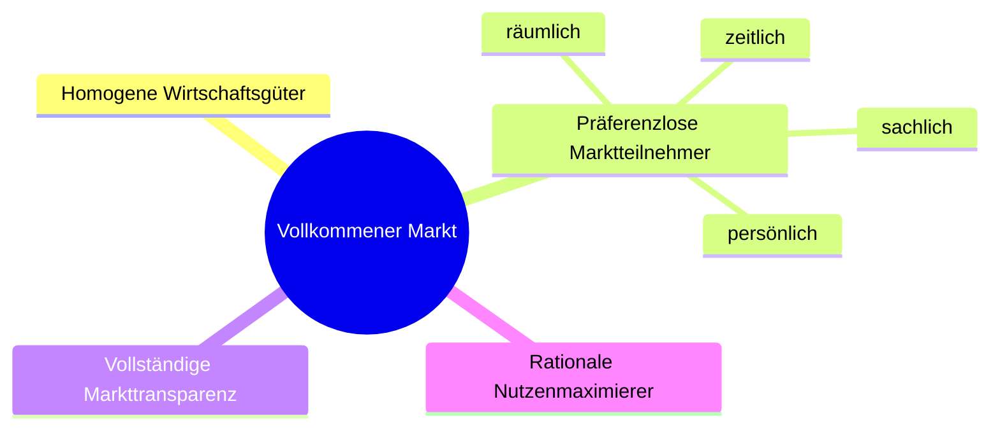

# Material

[DHBW_Inf_Marketing 1_SoSe 20256Kleinknecht.pdf](https://moodle.dhbw.de/mod/resource/view.php?id=456535)

## Marketing

Das Hauptziel des Marketings ist die Absatzsicherung für die Gegenwart und die Zukunft eines Unternehmens.

Marketing hat sich über die Zeit verändert. Bis in die 1920er Jahre waren Märkte Verkäufermärkte. Kunden haben also gekauft was es gab (mehr Nachfrage als Angebot). Erst über die Jahre sind dann moderne Marketingstrategien dazu gekommen.

**Definitionen Marketing**:

<table>
    <tr>
        <td>Unternehmensexterne Dimension</td>
        <td>Die Konzeption und Durchführung marktbezogener Aktivitäten eines
            Anbieters gegenüber (potenziellen) Nachfragern (Interessenten und
            Kunden). Dies beinhaltet die systematische Informationsgewinnung über
            Marktgegebenheiten, die Gestaltung des Leistungsangebots, die
            Preissetzung, die Kommunikation und den Vertrieb.</td>
    </tr>
    <tr>
        <td>Unternehmensinterne Dimension</td>
        <td>Die Schaffung der Voraussetzungen im Unternehmen für die effektive und
            effiziente Durchführung dieser marktbezogenen Aktivitäten. Dies schließt
            insbesondere die Führung des gesamten Unternehmens nach der Leitidee
            der Marktorientierung ein.</td>
    </tr>
    <tr>
        <td>Dimension der Beziehungsorientierung</td>
        <td>Sowohl die externen als auch die internen Ansatzpunkte des Marketing
            zielen auf eine im Sinne der Unternehmensziele optimale Gestaltung von
            Kundenbeziehungen ab.</td>
    </tr>
</table>

**Grundlagen**

- **Markt**: Ort, an dem Angebot und Nachfrage zu einem Preis führen
- **Marktteilnehmer**: Anbieter, Nachfrager oder Interessensgruppen
- **Markttheorien**: Erklären Funktionen und Phänomene eines Marktes
- **Offener Markt**: Lässt neue Anbieter zu
- **Geschlossener Markt**: Schließt neue Anbieter aus

**Markttheorien**

Zwei Grundrichtungen:

- Mikroökonomische Preistheorie (VWL)
- Marktprozesstheorie (BWL)

### Mikroökonomische Preistheorie (VWL)

Es werden verschiedene **Marktformen** unterschieden:

|                         | Einer (Anbieter)             | Wenige (Anbieter)             | Viele (Anbieter)  |
| ----------------------- | ---------------------------- | ----------------------------- | ----------------- |
| **Einer (Nachfrager)**  | Bilaterales Monopol          | Beschränktes Nachfragemonopol | Nachfragemonopol  |
| **Wenige (Nachfrager)** | Beschränktes Angebotsmonopol | Bilaterales Oligopol          | Nachfrageoligopol |
| **Viele (Nachfrager)**  | Angebotsmonopol              | Angebotsoligopol              | Polypol           |

**Beispiele Marktformen:**

- **Bilaterales Monopol:** Bundeswehr kauft Kampfflugzeug von einziger Firma in Deutschland
- **Anbietermonopol:** Nahverkehr in einer Stadt (ein Anbieter)
- **Nachfragemonopol:** Staat als einziger Nachfrager, z.B. Straßenbauunternehmen
- **Beschränktes Angebotsmonopol:** Staatliche Lotterien
- **Beschränktes Nachfragemonopol:** Rüstungsindustrie - Bundeswehr
- **Bilaterales Oligopol:** wenige Nachfrager und wenige Anbieter, z.B. Hersteller für Ersatzteile eines KFZ-Herstellers, Flugzeughersteller
- **Anbieteroligopol:** wenige Anbieter, z.B. Kinobetreiber
- **Nachfrageoligopol (wenige Nachfrager):** Landwirte - Molkereien
- **Polypol (viele Anbieter und viele Nachfrager):** Supermarkt, Aktienmarkt

**Vollkommener Markt** (4 Bedingungen):

### Marktprozesstheorie (BWL)

**Die wichtigsten Grundsätze:**

- Bei den Marktprozesstheoretikern steht das Individuum, dessen Handlungsweisen und subjektive Entscheidungen, im Vordergrund der Betrachtungen
- Der Markt besteht aus Individuen, die in verschiedenster Weise miteinander in Kontakt treten
- Verschiedene Personen bewerten z.B. das gleiche Produkt eventuell völlig unterschiedlich
- Alle sozioökonomischen Effekte können auf das individuelle Verhalten des Einzelnen zurückgeführt werden

**Mikroumfeld (Markt) und Makroumfeld (marktliches Umfeld):**

- **Mikroumfeld (Markt):** Nachfrager, Unternehmen, Lieferanten, Konkurrenten
- **Makroumfeld:** Ökonomisches, Rechtlich-politisches, Gesellschaftliches, Technologisches, Ökologisches, Kulturelles Umfeld

**Ordnung der Marktprozesse:**

<table>
    <tr>
        <th>Marktprozesse</th>
        <th>Marktstruktur</th>
        <th>Marktregeln</th>
    </tr>
    <tr>
        <td>
            <ul>
                <li>Sammeln, verdichten und verarbeiten tauschrelevanter Informationen</li>
                <li>Führen von Verhandlungen</li>
                <li>Abschluss von Vereinbarungen</li>
                <li>Austausch von Verfügungsrechten</li>
                <li>Koordination nach Vertragsabschluss</li>
            </ul>
        </td>
        <td>
            <ul>
                <li>Eigenschaften von Nachfragern, Konkurrenten und Lieferanten</li>
                <li>Eigenschaften des marktlichen Umfelds</li>
            </ul>
        </td>
        <td>
            <ul>
                <li>Regelsysteme für das Ausüben von Unternehmerfunktionen</li>
                <li>Elemente der Marktverfassung (Gesetze, ...)</li>
            </ul>
        </td>
    </tr>
</table>

### Marktkennzahlen

- **Marktvolumen:** Umsatz einer Branche in einem Markt
- **Marktpotential:** Maximales Umsatzvolumen eines Produktes auf einem Markt (in Euro/Jahr)
- **Marktsättigungsgrad:** Quotient aus Marktvolumen und Marktpotential
- **Marktanteil:** Anteil des eigenen Unternehmens am Marktvolumen
- **Relativer Marktanteil:** Eigener Marktanteil in Relation zum Marktanteil des stärksten Mitbewerbers. Wenn größer als 100%, hat das Unternehmen selbst den größten Marktanteil

### Formen der Geschäftsbeziehung (B2C, B2B, B2A)

- **B2C:** Business-to-Consumer
- **B2B:** Business-to-Business
- **B2A:** Business-to-Administration - Beziehung zwischen einem Unternehmen und Behörden oder einer Verwaltung.

Diese Kategorien spielen bei der Marktabgrenzung und Marktsegmentierung eine große Rolle, da sich die Bedürfnisse der Kunden oft stark unterscheiden.

### Marktabgrenzung

Die Bestimmung des **relevanten Marktes** eines Unternehmens bezeichnet man als Marktabgrenzung. Damit lassen sich z.B. folgende Fragen beantworten:

- Wie viele Nachfrager beinhaltet der Markt?
- Wie groß ist der Markt gemessen am zu erzielenden Umsatz?
- Wie viele Anbieter beinhaltet der Markt, und welche gehören zu den Hauptakteuren?
- Wie groß ist der Marktanteil eines Anbieters?
- Mit welcher Marktreaktion kann ein Unternehmen bei der Veränderung seiner Marketinginstrumente von Seiten der Konkurrenten und Nachfrager rechnen?
- Hat ein Unternehmen eine marktbeherrschende Stellung, so dass wettbewerbsrechtliche Regeln nicht mehr eingehalten werden können?

**Kriterien der Marktabgrenzung** (sowohl von Anbieter- als auch Nachfragerseite betrachtet):

- **Sachlich:** Welche Leistungen/Bedürfnisse?
- **Zeitlich:** Ist der Markt zeitlich begrenzt (saisonal, Tageszeiten)?
- **Räumlich:** Welche Orte bzw. Regionen?
- **Marktstufenbezogen:** Zu welchen Verarbeitungs-, Verwendungs- oder Handelsstufen gehören Anbieter und Nachfrager?

Der **relevante Markt** ergibt sich aus den Kriterien der Anbieter, der subjektiven Bereitschaft zur Substitution und den Nachfragern.

### Marktsegmentierung

Marktsegmentierung umfasst drei Aspekte:

- **Informationsaspekt:** Markterfassung und anschließende Zerlegung in Teilmärkte (Marktsegmente) mit Abnehmergruppen, die homogener als der Gesamtmarkt auf absatzpolitische Aktivitäten reagieren
- **Entscheidungsaspekt:** Die anschließende Auswahl der zu bearbeitenden Marktsegmente
- **Aktionsaspekt:** Die Bearbeitung der Segmente mittels geeigneter Marketing-Instrumente (Ausrichtung des Marketing-Mix auf die Marktsegmente)
