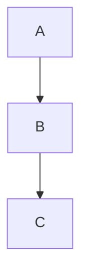
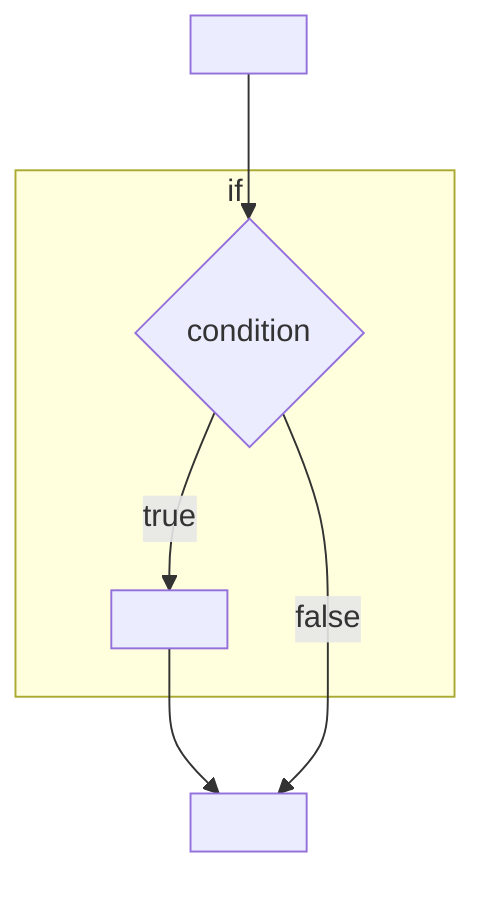
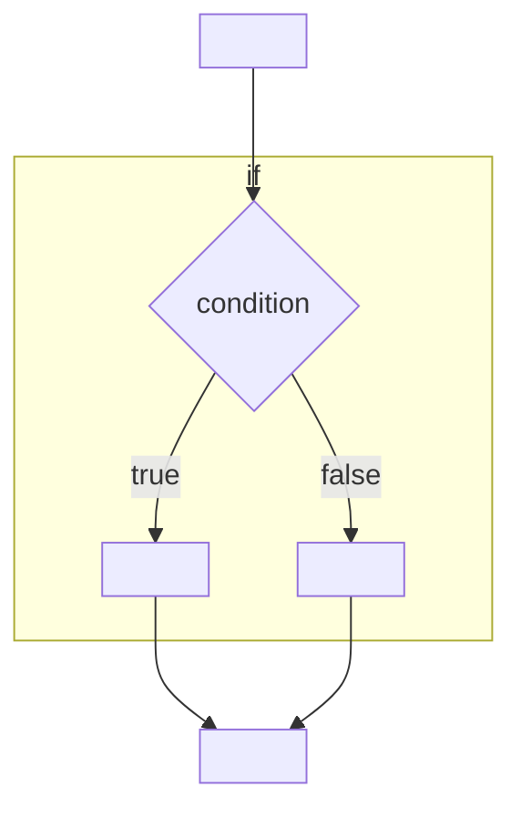
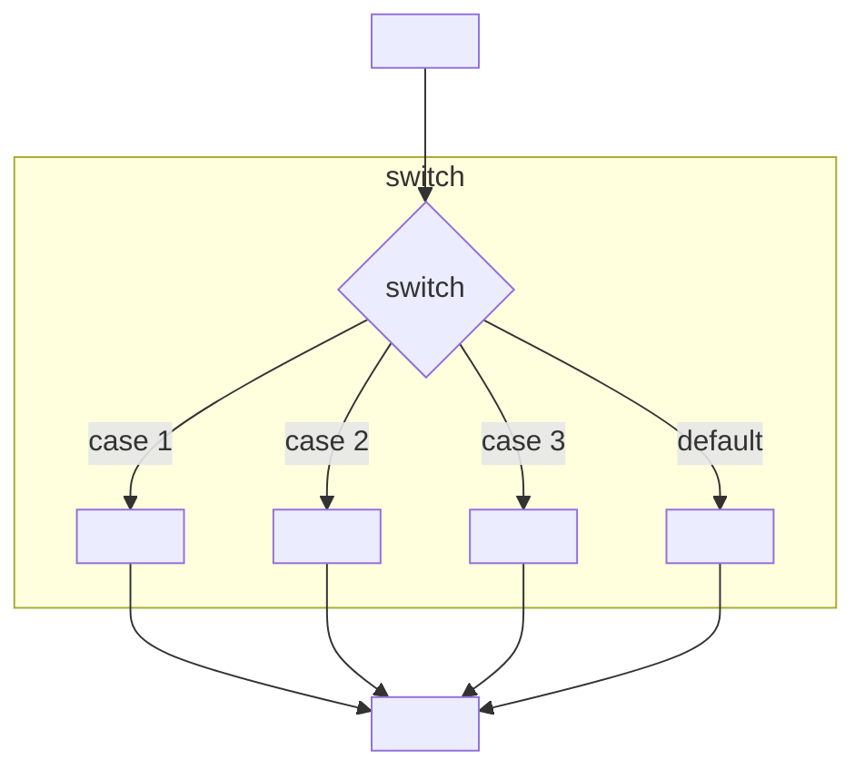
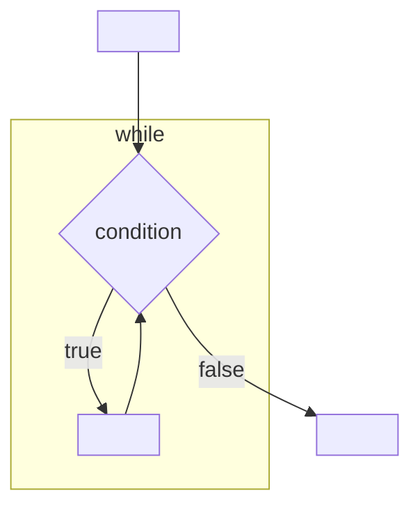
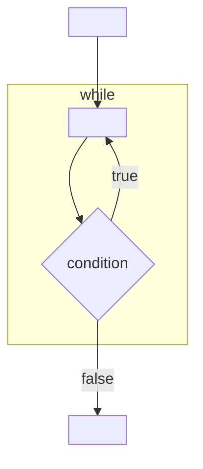
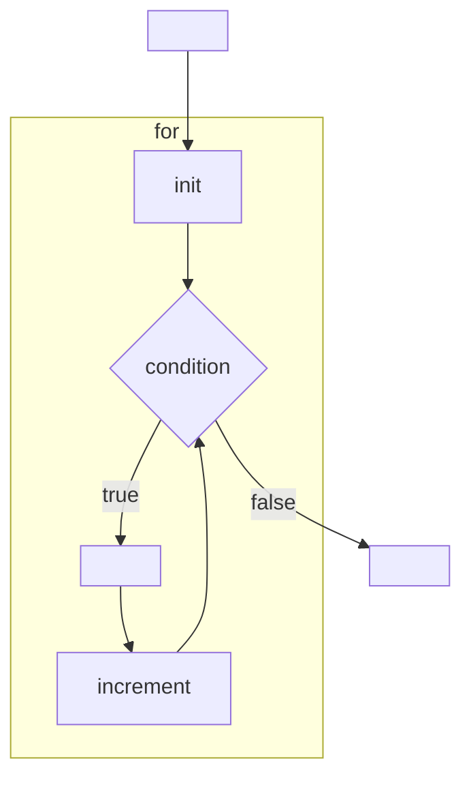

# Material

[Alle](https://www.iai.kit.edu/javavl/DhbwSlides.class)

[06_Kontrollstrukturen.pdf](https://www.iai.kit.edu/javavl/data/dhbw/2025-26/06_Kontrollstrukturen.pdf)

[06_Kontrollstrukturen_Aufgaben.pdf](https://www.iai.kit.edu/javavl/data/dhbw/2025-26/06_Kontrollstrukturen_Aufgaben.pdf)

## Besprechung der Aufgaben

Wir haben [Round](../2026-01-19/Round.java) und [Easter](../2026-01-19/Easter.java) besprochen

## Kontrollstrukturen

**Sequenz**

Normale Abfolge von Anweisungen:



Beispiel:

```java
statement1;
statement2;
```

**Verzweigungen**

If Anweisung:



Beispiel:

```java
if (condition) {
    statement;
}
```

If-Else Anweisung:



Beispiel:

```java
if (condition) {
    statement1;
} else {
    statement2;
}
```

Switch Anweisung



Beispiel:

```java
switch (expression) {
    case match1:
        statement1;
        break;
    case match2:
        statement2;
        break;
    default:
        statement3;
}
```

**Schleifen**

While Schleife



Beispiel:

```java
while (condition) {
    statement1;
}
```

Do-While Schleife



Beispiel:

```java
do {
    statement;
} while (condition)
```

For Schleife



Beispiel:

```java 
for (int i = 0; i < 10; i++) {
    statement;
}
```

## Aufgaben

[06_Kontrollstrukturen_Aufgaben.pdf](https://www.iai.kit.edu/javavl/data/dhbw/2025-26/06_Kontrollstrukturen_Aufgaben.pdf)

[Quadratische Gleichung](./Quadratics.java)
[LeapYear](./LeapYear.java)
[TemperatureTable](./TemperatureTable.java)
[Deers](./Deers.java)
[MultiplicationTable](./MultiplicationTable.java)
[AddUp](./AddUp.java)
[ShoeSize](./ShoeSize.java)
[Babylon](./Babylon.java)
[NumberGuess](./NumberGuess.java)