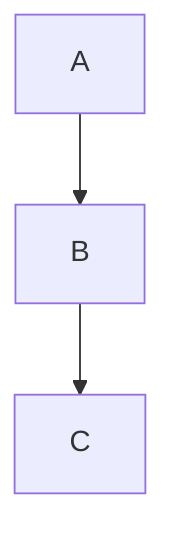

# Material

TODO

## Besprechung der Aufgaben

Wir haben [Round](../2026-01-19/Round.java) und [Easter](../2026-01-19/Easter.java) besprochen

## Kontrollstrukturen

**Sequenz**

Normale Abfolge von Anweisungen:

**Verzweigungen**

If Anweisung:

TODO: mermaid

If-Else Anweisung:

TODO: mermaid

Switch Anweisung

TODO: mermaid

**Schleifen**

While Schleife

TODO: mermaid

Do-While Schleife

TODO: mermaid

For Schleife

TODO: mermaid

## Aufgaben

[Quadratische Gleichung](./Quadratics.java)

TODO: andere aufgaben