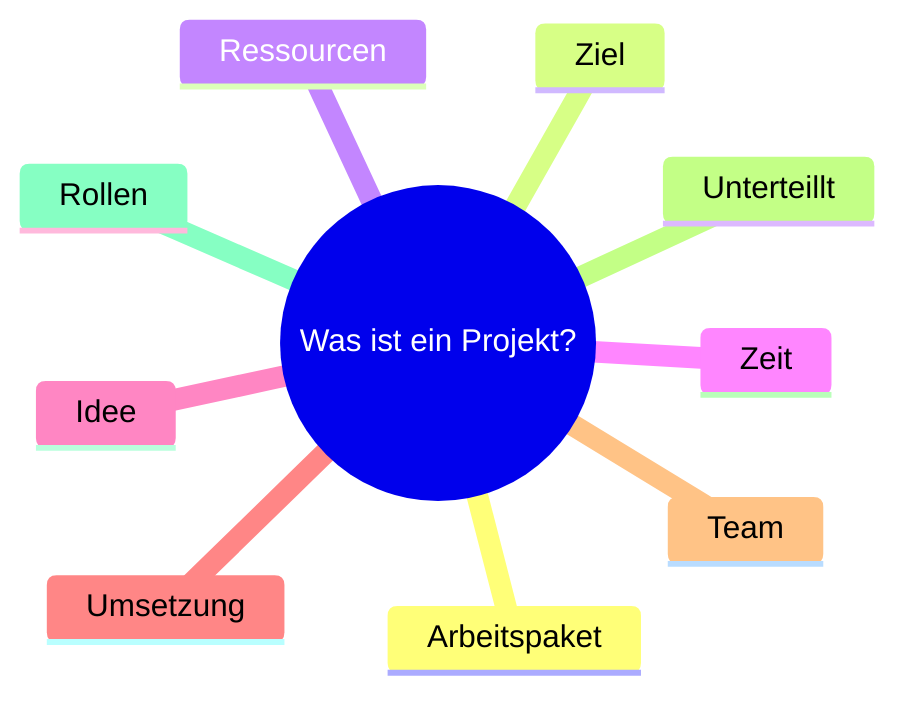
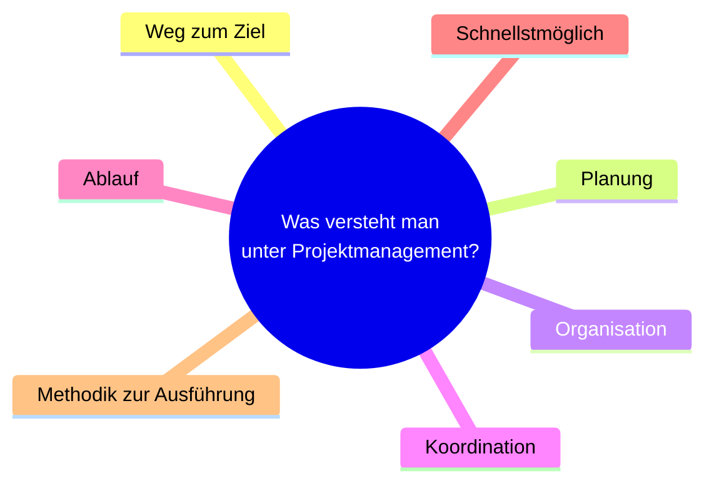
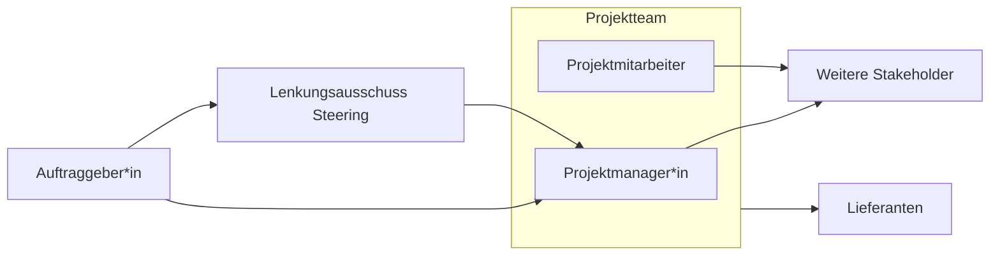
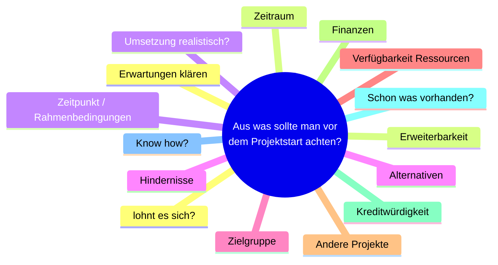

# Material

Veröffentlichung ist nicht gestattet. Veröffentlichung/zitieren von Ausschnitten ist gestattet. Weitergabe ist gestattet.

[PM_1_Einführung.pdf](https://moodle.dhbw.de/mod/resource/view.php?id=359655)

[PM_2_Grundlagen.pdf](https://moodle.dhbw.de/mod/resource/view.php?id=359656)

[PM_3_Definition_Initialisierung.pdf](https://moodle.dhbw.de/mod/resource/view.php?id=359660)

## Definitionen

Weitere wichtige Parameter:

- Projektleiter und Team
- Projektspezifische Organisation
- Interdisziplinäre Zusammenarbeit
- Stakeholder / Betroffene / Beteiligte
- Rahmenbedingungen / Voraussetzungen
- Einbettung und Abgrenzung gegenüber anderen Vorhaben
- Risiken
- Business Care /wirtschaftlicher Kontext

Definition:

> Projektmanagement ist das Anwenden von Wissen, Fähigkeiten, Werkzeugen und Methoden auf
Vorgänge des Projekts, damit die Anforderungen des Projekts erfüllt werden.

PMBOK® Guide

> Gesamtheit von Führungsaufgaben, -organisation, -techniken und -mitteln für die Initiierung, Definition,
Planung, Steuerung und den Abschluss von Projekten.

DIN 669901

## Grundlagen Projektmanagement

- Qualität (Leistung, Umfang)
- Kosten
- Zeit

Meistens wird wird die Qualität vorgegeben. Kosten/Ressourcen und Zeit/Termine wird daran abgeleitet bzw. geschätzt.

Andersherum ist es aber auch möglich: Wenn man die einen Kostenrahmen und Zeitrahmen gegeben hat, kann man daraus schärzen, welche Leistung/Umfang man damit erarbeiten kann.

Projektrollen

Projektmanager

- Wird vom Lenkungsausschluss benannt
- Verantwortlich für den Erfolg des Projekts
- Organisiert, plant, steuert, kontrolliert, macht Änderungen und schließt das Projekt ab
- Kümmert sich um die Struktur und verteillt Aufgaben
- Zusätzlich: Controlling und Risikomanagement
- Stellt das Team zusammen oder bestimmt dabei mit
- Verantwortlich für Team Building und Konfliktmanagement
- Diese Rolle ist Zeitlich auf die Dauer des Projekts begrenzt

Auftraggeber

- Stellt den Auftrag
- Sichert die finanzierung
- Abnahme des Projekts und erklärt den Erfolg oder Misserfolg des Projekts
- Setzt Projektleiter ein

Lenkungsausschuss / Steering

- Für Rückfragen vom Projektmanager oder Auftraggeber
- Projektmanager berichten regelmäßig an den Lenkungsausschuss
- Trifft grundlegende Entscheidungen, die vom Projektmanager abgegeben werden

Projektmitarbeiter

- Berichten an den PM
- Erledigen die ihnen zugeteillte Arbeit
- Können auch verantwortung für Teilbereiche übernehmen
- Dem PM oder anderen (Linien-) Managern untergeordnet

Lieferanten

- Kein Teil des Projektteams
- Erfüllen ihre vereinbarten Leistungen um zu den Arbeitspaketen beizutragen
- Können aus anderen Abteillungen oder komplett extern sein
- Absprache mit PM oder anderem Ansprechpartner notwendig

Stakeholder

Die Personen, die sonst noch von Projekt betroffen sind

- Das können verschiedene Personen sein
- Oft sind das Vorgesetzte von mitarbeitern
- Entwicklungsleiter und Architekten
- Expertenteam (Fachausschuss)
- Programm und Protfolio Manager
- Projektcontroller
- Qualitätsmanagement
- Marketing und Vertrieb

## Phasen im Projektmanagement

| Phase           | Tätigkeiten                                               |
| --------------- | --------------------------------------------------------- |
| Initialisierung | Zieldefinition, Analyse, Auftrag                          |
| Definition      | Konkretisierung, Anforderungen, Meilensteine, Stakeholder |
| Planung         | Projektstruktur, Ressourcen, Kosten, Termine              |
| Steuerung       | Controlling, Änderungsmanagement                          |
| Abschluss       | Auslieferung, Team auflösen, Lessons learned              |

Vorgehensmodelle

- Sequentielle modelle (Ein Schritt nach dem anderen)
  - Wasserfallmodell
  - V-Modell
- Nebenläufige Modelle (überlappende Schritte)
  - Simultanious Engineering
- Wiederholende Modelle (mehrere Iterationen)
  - Inkrementelles Modell
  - Spiralmodell

# Kapitel 3 Projektdefinitionen

Wir befassen uns hiermit der Phase initialisierung und Definition zusammengefasst

- Zunächst Anforderung klar dokumentieren und verstehen
- Nicht gleich in einer (vermeintliche) Lösung springen
- Wie sind die Rahmenbedingungen?
- Stehen die erforderlichen Ressourcen zur Verfügung?
- Stehen qualifizierte Personen zur Verfügung, die ggf. im Team mitarbeiten können?
- Ist der Zeitrahmen angemessen?
- Gibt es verlässliche Lieferanten?
- Sind zuerst machbarkeitsanalysen notwendig?

Gute Planugn am Anfang erspart später teure Korrekturen.

