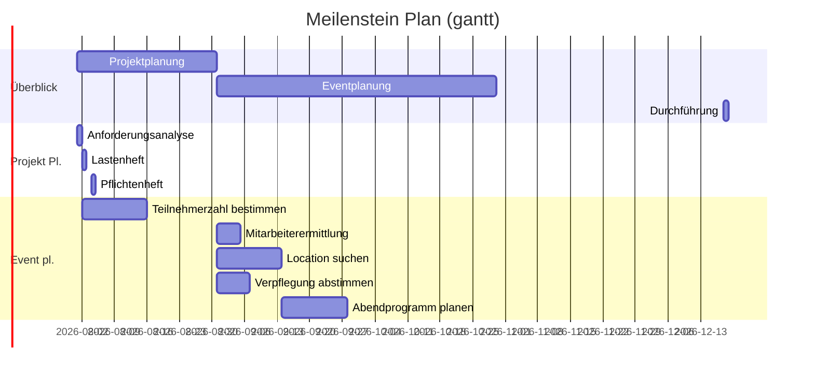

# Material

TODO

## Besprechung der Lastenhefte

Wir haben alle unsere Lastenhefte von letzter Stunde besprochen

## Projektaufwand

| Unsicherheit größer                     | Unsicherheit kleiner             |
| --------------------------------------- | -------------------------------- |
| Ziele nur grob definiert                | Aufgabe genau spezifiziert       |
| Viel Forschung und entwicklung benötigt | Methoden und abläufe stehen fest |

TODO: tabelle übernehmen

**Cone of uncertainty**

Zwsichen Projektidee und Projektabschluss nähert sich der tatsächliche Projektaufwand der Schätzung immer genauer an. Am Anfang verschätzt man sich um bis zu das 4-fache nach unten oder oben. Diese Spanne verringert sich über die Zeit bis zum tatsächlichen Abschluss.

**Methoden zur Aufwandsschätzung**

- Erfahrungen aus früheren Projekten einbeziehen
- Experten befragen: Gemeinsame Schätzungen, Mehrfachbefragungen, Planungs-Poker
- Zweipunktschätzung: Optimistische und pessimistische Schätzung
- Dreipunktschätzung: Aus wahrscheinlicher, pessimistischer und optimistischer Schätzung
- Funktionspunktverfahren: Aufgaben mit Punkten, Gewichtung und Komplexitätsfaktoren

**V-Modell**

TODO: Grafik aus folie übernehmen

## Meilensteinplan

TODO: mit den anderen besprechen