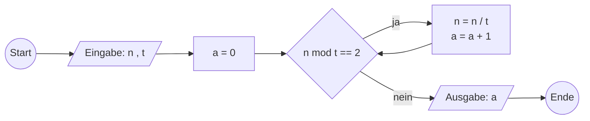

# Material

Folien stehen nicht zur Verfügung.

[Theoretische-Informatik-I.pdf](https://moodle.dhbw.de/mod/resource/view.php?id=363680)

## Beschreibung von Algorithmen

Ein Algorithmus ist eine exakte Vorschrift zur Problemlösung.

- Eingabedaten
- Ausgabedaten
- Verarbeitungsschritte

Ein Alogrithmus ist:

- eine eindeutige und endliche Beschreibung
- allgemein endliches Verfahren
- mit begrenzten Ressourcen
- Schrittweise Lösung des Problems

Man kann sie beschreiben in Sprache, Pseudocode oder Diagrammen.

Eigenschaften:

- Allgemeinheit (Lösung einer ganzen Problemklasse)
- Ausführbarkeit (Schritte sind tatsächlich ausführbar)
- Determinismus (Jeweils folgende Schritte sind eindeutig)
- Determiniertheit (Gleiche Eingaben liefert gleiches Ergebnis)
- Finitheit (Beschreibung ist endlich)
- Terminierung (Ausführung ist endlich)
- Dynamische Finitheit (Beschränkter Ressourcenbedarf)
- Komplexität (Abschätzung Laufzeit oder Ressourcenbedarf)

Ein Algorithmus sollte eine Klasse von Problemen lösen, nicht nur eine Ausprägung. Also nicht nur für Eingaben (1,2) sondern für alle (a,b).

## Rekursion und Iteration

Zur Lösung vieler Problemstellungen werden Widerholungen benötigt. Daher ist es naheliegend, dass eine Programmiersprache oder ein Berechnungsmodeell ei Konzept für die wiederholte Ausführung von Algorithmenteilen besitzen sollte, um für die Umsetzung von Algorithmen zur Lösung von möglichst vielen Problemstellungen geeignet zu sein. Ttsächliche gibt es fafür verschiedene Umsetzungsmöglichkeiten von der primitiven Rekursion bis hin zur Turing-Vollständigkeit, was im dritten Teil der Vorlesungsreihe noch genauer betrachtet wird. Mögliche Umsetzungen dafür sind di klassischen iterativen und imperativen `for`, `while`, `do-while` oder `repeat-until`-Schleifen.

Die Rekursion wird teilweise als allgemeinste und Paradigmen-übergreifende Schleifenform gesehen, und wird daher in der theoretischen Informatik konzeptionell eng mit der Zählbarkeit und Berechenbarkeit verknüpft.

Eine Schleife ist eine Kontrollstruktur, die eine bedingte wiederholte Ausführung von einzelnen Ausführungsschritten dargestellt, wobei eine einzelne Durchführung als Iteration bezeichnet wird.

Ein Algorithmus ist rekursiv, wenn in der Beschreibung des Algorithmus der Algorithmus selbst als ein Ausführungsschritt aufgerufen wird.

## Korrektheit von Algorithmen

Mit dem **Hoare-Kalkül** kann man systematisch Vorgehen, um die Korrektheit von einem Algorithmus nachzuweisen.

Ein Hoare Tripel $P\{S\}K$ besteht aus einer Prämisse, Anweisung und Konklusion.

Die Komposition zweier Hoare-Tripel $P_1 \{S_1\} K_1$ und $P_2 \{S_2\} K_2$ ergibt ein Hoare-Tripel $P_1 \{S_1;S_2\} K_2$. Geschrieben:

$$
\frac{P_1 \{S_1\} K_1 \quad\quad P_2 \{S_2\} K_2}{P_1 \{S_1;S_2\} K_2}
$$

wenn $K_1 \Rightarrow P_2$ oder $K_1 = P_2$ gilt, dann werden $K_1$ und $P_2$ auch Zwischenbedingungen genannt.

Das Hoare-Tripel einer Iteration wird mit Hilfe einer Schleifenbedingung und einer Invariante beweisen: Ist I eine Invariante einer Anweisung S, also $I \land S \{S\} I$ ein Hoare-Tripel, so folgt daraus das Hoare-Tripel der Schleife über S solange B gilt, also:

$$
\frac{I \land B \{S\}I}{I \{ \text{while } B \text{ do } S \text{ end} \} I \land \neg B}
$$

wobei die while-Schleifge mit Inhalt S so lange ausgefü+hrt wird, bis B nicht mehr erfüllt ist.

Das Hoare-Tripel einer Fallunterscheidung hat die identische Konklusion in den Fällen:

$$
\frac{P \land B \{S_1\} K \quad\quad P \land \neg B \{S_2\} K}{P \{\text{if } B \text{ then } S_1 \text{ else } S_2\}K}
$$

---

Beispiel: ggT

Eingabe: Natürliche Zahlen p, q
Ausgabe: Ganzzahl ggT g

1. Minimum m von p, q ermitteln
2. Zähle z absteigend von m bis 1
3. Prüfe, ob p und q sich ohne Rest durch z teilen lassen
4. Wenn ja, so ist g = z und Ende, sonst mit nächstem z mit Schritt 3

Endet immer, spätestens bei 1.

Pseudocode:

```
Algorithm ggT-Naiv(p,q)
    z = min(p, q)
    while(p mod z != 0 or q mod z != 0) do
        z = z - 1
    endwhile
    return z
endAlgorithm
```

---

71.

```
Algorithm teilerPotenz(n, t)
    a = 0

    while n mod t == 0 do
        n = n / t
        a = a + 1
    endwhile
    return a
EndAlgorithm
```

