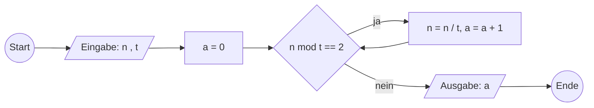

# Material

TODO

## Beschreibung von Algorithmen

Ein Algorithmus ist eine exakte Vorschrift zur Problemlösung.

- Eingabedaten
- Ausgabedaten
- Verarbeitungsschritte

Ein Alogrithmus ist:

- eine eindeutige und endliche Beschreibung
- allgemein endliches Verfahren
- mit begrenzten Ressourcen
- Schrittweise Lösung des Problems

Man kann sie beschreiben in Sprache, Pseudocode oder Diagrammen.

Eigenschaften:

- Allgemeinheit (Lösung einer ganzen Problemklasse)
- Ausführbarkeit (Schritte sind tatsächlich ausführbar)
- Determinismus (Jeweils folgende Schritte sind eindeutig)
- Determiniertheit (Gleiche Eingaben liefert gleiches Ergebnis)
- Finitheit (Beschreibung ist endlich)
- Terminierung (Ausführung ist endlich)
- Dynamische Finitheit (Beschränkter Ressourcenbedarf)
- Komplexität (Abschätzung Laufzeit oder Ressourcenbedarf)

Ein Algorithmus sollte eine Klasse von Problemen lösen, nicht nur eine Ausprägung. Also nicht nur für Eingaben (1,2) sondern für alle (a,b).

## Rekursion und Iteration

Zur Lösung vieler Problemstellungen werden Widerholungen ... 
TODO foto

Eine Schleife ist eine Kontrollstruktur, die eine bedingte wiederholte Ausführung von einzelnen Ausführungsschritten dargestellt, wobei eine einzelne Durchführung als Iteration bezeichnet wird.

Ein Algorithmus ist rekursiv, wenn in der Beschreibung des Algorithmus der Algorithmus selbst als ein Ausführungsschritt aufgerufen wird.

## Korrektheit von Algorithmen

Mit dem **Hoare-Kalkül** kann man systematisch Vorgehen, um die Korrektheit von einem Algorithmus nachzuweisen.

Ein Hoare Tripel $P\{S\}K$ besteht aus einer Prämisse, Anweisung und Konklusion.

TODO: komposition aus hoare tripel

TODO: Das Hoard-Tripel einer Iteration wird mit Hilfe einer Schleifenbedingung und einer Invariante beweisen.

TODO: Fallunterscheidung

---

Beispiel: ggT

Eingabe: Natürliche Zahlen p, q
Ausgabe: Ganzzahl ggT g

1. Minimum m von p, q ermitteln
2. Zähle z absteigend von m bis 1
3. Prüfe, ob p und q sich ohne Rest durch z teilen lassen
4. Wenn ja, so ist g = z und Ende, sonst mit nächstem z mit Schritt 3

Endet immer, spätestens bei 1.

Pseudocode:

```
Algorithm ggT-Naib(p,q)
    z = min(p, q)
    while(p mod z != 0 or q mod z != 0) do
        z = z - 1
    endwhile
    return z
endAlgorithm
```

---

71.

```
Algorithm teilerPotenz(n, t)
    a = 0

    while n mod t == 0 do
        n = n / t
        a = a + 1
    endwhile
    return a
EndAlgorithm
```



---

72.

TODO: aus Lösungen abschreiben

---