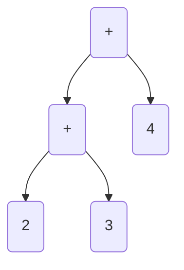
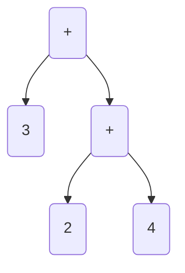
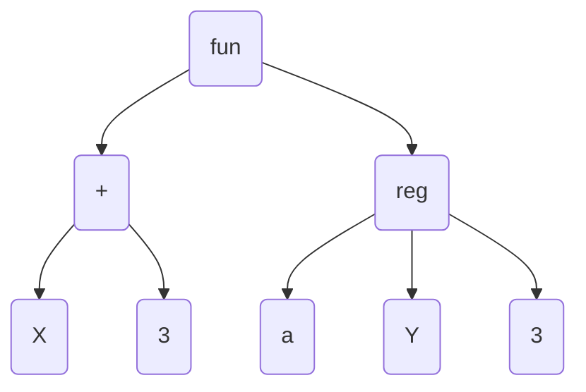

# Material

Folien stehen nicht zur Verfügung.

[Theoretische-Informatik-I.pdf](https://moodle.dhbw.de/mod/resource/view.php?id=363680)

## Programmierparadigmen

Imperative Programmierung:

- Wie wird as Problem gelöst?
- Explizite Reihenfolge von Programmschritten

Deklarative Programmierung

- Was ist zu lösen?
- Defintion von Lösungsregeln
- Keine explizite Angabe von Reihenfolgen

Beispiele:

Imperativ: Kochrezept: 1. ..., 2. ...

Deklarativ: Spielregeln

Paradigmen:

- Imperativ: pascal, ALGOL
- Prozedual: C, BCPL
- OO: Simula, Smalltalk
- Logisch: Prolog
- Funktional: Haskell
- Domänenspezifisch: SQL

## Prolog

In Prolog kann man ein Prädikat anlegen:

```prolog
parentOf(rick, beth). /* rick is parent of beth */
parentOf(beth, morty). /* beth is parent of morty */
...
```

Man kann eine Regel erstellen:

```prolog
descendantOf(X,Z) :- /* if (:-) */
    parentOf(Z,X); /* OR (;) */
    parentOf(Z,Y), descendantOf(X,Y).
```

Das Programm ist die Definition von Aussagen und Regeln

**Konstanten** sind klein geschriebene **Atome**, z.B. `rock` oder `summer`

**Variablen** beginnen mit einem Großbuchstaben

**Zusammengesetzte Begriffe** bestehen aus einem Atom als **Funktor** vor Klammern und weiteren durch Komma getrennten Argumenten, wie `descendant(X, rick)` oder `f(g(X), +(3, q), Mu, eps)`

Ein **Operand** in Prolog ist ein speziell markiertes Atom, mit festgelegter Position, Priorität und Assoziativität, die eine vereinfachte Schreibweise von zusammengesetzten Begriffen ermöglichen. 

- Prefix: `-Y` ist `-(Y)`
- Infix: `X + 6` ist `+(X, 6)`
- Postfix: `n!` ist `!n`

Ein **Ausdrucksbaum** bezeichnet die hierarchische Darstellung eines Ausdrucks:

`2+3+4`:



`3+(2+4)`:



`fun(X + 3, reg(a, Y, 3))`:



Ein **Programm** besteht aus eienr Auflistung von **Prozeduren**

- Jede Prozedur bestimmt ein Prädikat, das Zusammenhänge dessen Argumenten herstellt
- Jede Prozedur besteht aus einem oder mehreren Sätzen, die jeweils mit einem Punkt abgeschlossen werden
- Ein Satz ist ein Fakt, das ist ein immer gültiger zusammengesetzter Begriff,
- oder eine Regel, der Form $H :- B$, wobei der Ausdruck H als Kopf und B als Körper bezeichnet wird, und der im Kopf dargstellte Ausdruck gilt, wenn der Klrper nachweisbar ist
- Besteht ein Körper aus mehreren Ausdrücken, so werden die Teilauasdrücke Ziele genannt, sonst ist der Körper das Ziel.

Ziele können durch logische Operatoren verbunden werden:

- `,` logisches Und
- `;` logisches Oder
- `\+` Negation durch Nicht-Beweisbarkeit

Zwei Ausdrücke sind unifizierbar, wenn es für die in beiden Ausdrücken auftretenden Variablen Substitutionen existieren, so dass die Ausdrucksbäume der beiden Ausdrücke identisch sind. Die Unifikation wird auch **Pattern Matching** oder Matching genannt.

Wenn zwei Ausdrücke (oder Bariablen mit Ausdrücken) X und Y unifizierbar sind, genau dann ist X = Y wahr, sonst falsch. Sind die Ausdrücke identisch, so ist genau dann X == Y wahr, Sind zwei Ausdrücke nicht unifizierbar, so ist X \= Y genau dann wahr. Sind zwei Ausdrücke nicht identisch, so ist X \== Y genau dann wahr.

Beispiel:

- `1 + 3 = X + 3`: true
- `1 + 3 \= X + 3`: true (TODO, ich glaube hier ist was falsch)
- `1 + 3 == x + 3`: false
- `1 + 3 \== X + 3`: true

Eine **Anfrage** ist eine Zielbeschreibung, die aus einem Ziel oder mehreren durch logische Operatioren verbundenen Teilzielen definiert. Die Ziele können Variablen beinhalten, deren Belegung durch Unifikationen mit dem Prolog-Programm untersucht werden soll.

Einschränkungen:

- Es können nur definierte Mengen durchzählt werden
- Das bedeutet insbesondere, dass beispielsweise später behandelte Berechnungen nicht magisch
umgekehrt werden können.
- Umkehrfunktionen müssen explizit in Prozeduren angegeben werden.
