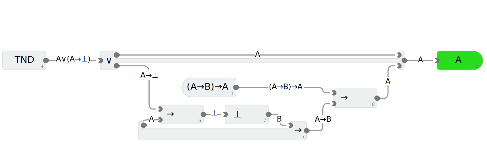

# Übungsblatt 2

Material: [Übungsblatt 2](https://moodle.dhbw.de/mod/resource/view.php?id=363685)

1.

(a)

| $A$                 | $B$                 | $\neg B \rightarrow \neg A$ | $A \land (\neg B \rightarrow \neg A)$ | $(A \land (\neg B \rightarrow \neg A)) \rightarrow B$ |
| ------------------- | ------------------- | --------------------------- | ------------------------------------- | ----------------------------------------------------- |
| $\color{green}\top$ | $\color{green}\top$ | $\color{green}\top$         | $\color{green}\top$                   | $\color{green}\top$                                   |
| $\color{green}\top$ | $\color{red}\bot$   | $\color{red}\bot$           | $\color{red}\bot$                     | $\color{green}\top$                                   |
| $\color{red}\bot$   | $\color{green}\top$ | $\color{green}\top$         | $\color{red}\bot$                     | $\color{green}\top$                                   |
| $\color{red}\bot$   | $\color{red}\bot$   | $\color{green}\top$         | $\color{red}\bot$                     | $\color{green}\top$                                   |

(b)

$$
\begin{align*}
(A \land (\neg B \rightarrow \neg A)) \rightarrow B &= (A \land (B \lor \neg A)) \rightarrow B &\text{(H.)} \\
&= ((A \land B) \lor (A \land \neg A)) \rightarrow B &\text{(Dist.)} \\
&= ((A \land B) \lor \bot) \rightarrow B &\text{(Komplem.)} \\
&= (A \land B) \rightarrow B &\text{(Neutral.)} \\
&= \neg(A \land B) \lor B &\text{(H.)} \\
&= (\neg A \lor \neg B) \lor B &\text{(De Morgan)} \\
&= \neg A \lor (\neg B \lor B) &\text{(Assoz.)} \\
&= \neg A \lor \top &\text{(Komplem.)} \\
&= \top &\text{(Ausl.)} \\
\end{align*}
$$

(c)

(d)

| Schritt | Aussage                                                                         | Begründung       |
| ------- | ------------------------------------------------------------------------------- | ---------------- |
| 1       | $A \land ((B \rightarrow \bot) \rightarrow (A \rightarrow \bot))$               | Prämisse         |
| 2       | $A$                                                                             | KL 1             |
| 3       | $(B \rightarrow \bot) \rightarrow (A \rightarrow \bot)$                         | KR 1             |
| 4       | $B \lor (B \rightarrow \bot)$                                                   | TND              |
| 5.1     | $B$                                                                             | 1. Annahme aus 4 |
| 5.2.1   | $B \rightarrow \bot$                                                            | 2. Annahme aus 4 |
| 5.2.2   | $A \rightarrow \bot$                                                            | IE 3 5.2.1       |
| 5.2.3   | $\bot$                                                                          | IE 5.2.2 2       |
| 5.2     | $B$                                                                             | F 5.2.3          |
| 5       | $B$                                                                             | D 4 5.1 5.2      |
| 6       | $A \land ((B \rightarrow \bot) \rightarrow (A \rightarrow \bot)) \rightarrow B$ | II 1 5           |

2.

| Schritt | Aussage                                           | Begründung        |
| ------- | ------------------------------------------------- | ----------------- |
| 1       | $(A \rightarrow B) \rightarrow A$                 | Prämisse          |
| 2       | $A \lor (A \rightarrow \bot)$                     | TND               |
| 3.1     | $A$                                               | 1. Annahme aus 2  |
| 3.2     | $A \rightarrow \bot$                              | 2. Annahme aus 2  |
| 3.3.1   | $A$                                               | Annahme           |
| 3.3.2   | $\bot$                                            | IE 3.2 3.3.1      |
| 3.3.3   | $B$                                               | F 3.3.2           |
| 3.3     | $A \rightarrow B$                                 | II 3.3.1 .. 3.3.3 |
| 3.4     | $A$                                               | IE 1 3.3          |
| 3       | $A$                                               | D 2 3.1 3.4       |
| 4       | $((A \rightarrow B) \rightarrow A) \rightarrow A$ | II 1 3            |

3.

a) $\exists y : \neg \exists x : F(x,y)$: Es gibt eine Person, der niemand folgt.
b) $\neg\forall x : \exists y : \neg F(x,y)$: Die Aussage „Jeder hat eine Person, der sie oder er nicht folgt.“ ist falsch
c) $\forall y : \forall x : \neg F(x,y)$: Alle haben keine Follower.
d) $\forall y : \exists x : F(x,y)$: Jeder hat (mind. eine(n)) Follower.
e) $\exists x : \neg \exists y : F(x,y)$: Es gibt jemanden, der niemandem folgt.
f) $\exists x : \exists y : F(x,y)$: Es gibt eine Person, die einer anderen Person folgt.

Aus der Aufgabenstellung auf Moodle lassen sich folgende Implikationen feststellen:

- $C \rightarrow A$
- $C \rightarrow E$
- $B \rightarrow F$
- $B \rightarrow D$
- $D \rightarrow F$

4.

TODO

5.

TODO