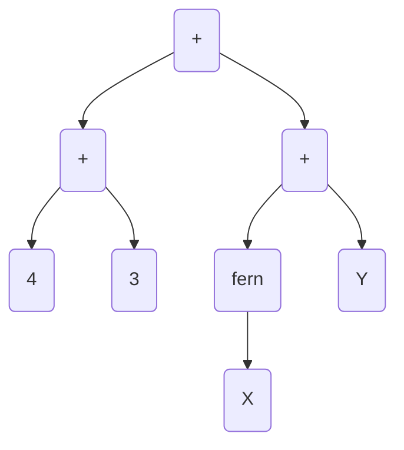
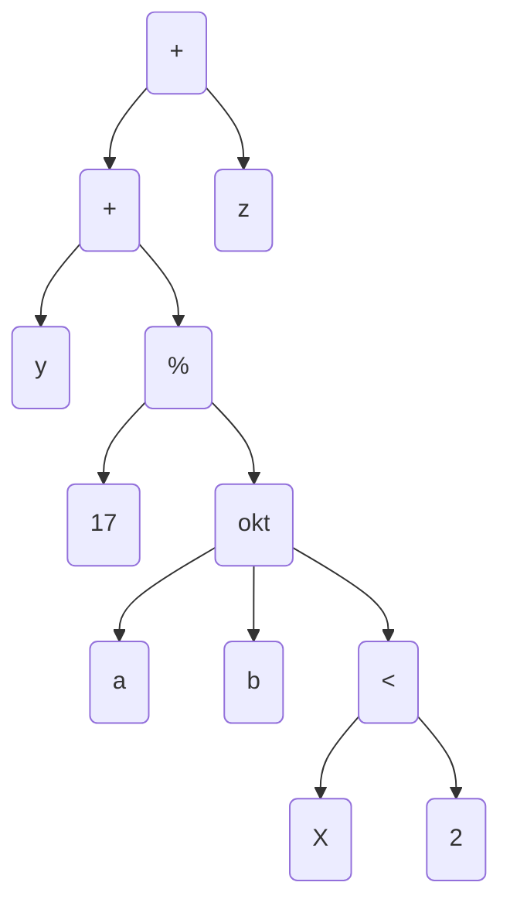

# Übungsblatt 8

[ti-i-blatt-08.pdf](https://moodle.dhbw.de/mod/resource/view.php?id=363697)

---

1.

(a)



(b)



---

2.

(a)

Wenn man für `X=7` und `Y=3` einsetzt, sind beide Ausdrücke gleich.

(b)

Man kann für `Y=f(a)` und `Z=f(Y)` also `Z=f(f(a))` einsetzen, dann sind beide Ausdrücke gleich.

(c)

Nicht unifizierbar, da

- `X=f(Y)`
- `Y=f(X)`

Dann wäre `X=f(f(X))`, was keine Lösung findet, da X immer weiter in sich selber eingebaut wird.

---

3.

```prolog
v(at, ch).
v(at, cz).
v(be, de).
v(be, lu).
v(be, nl).
v(ch, fr).
v(cz, de).
v(cz, pl).
v(de, dk).
v(de, fr).
v(de, lu).
v(de, nl).
v(de, pl).
v(fr, lu).

grenze(X,Y) :- v(X,Y); v(Y,X).

transit(X, Y) :- grenze(X,Z),grenze(Z,Y),Z \= de, X \= Y.
```