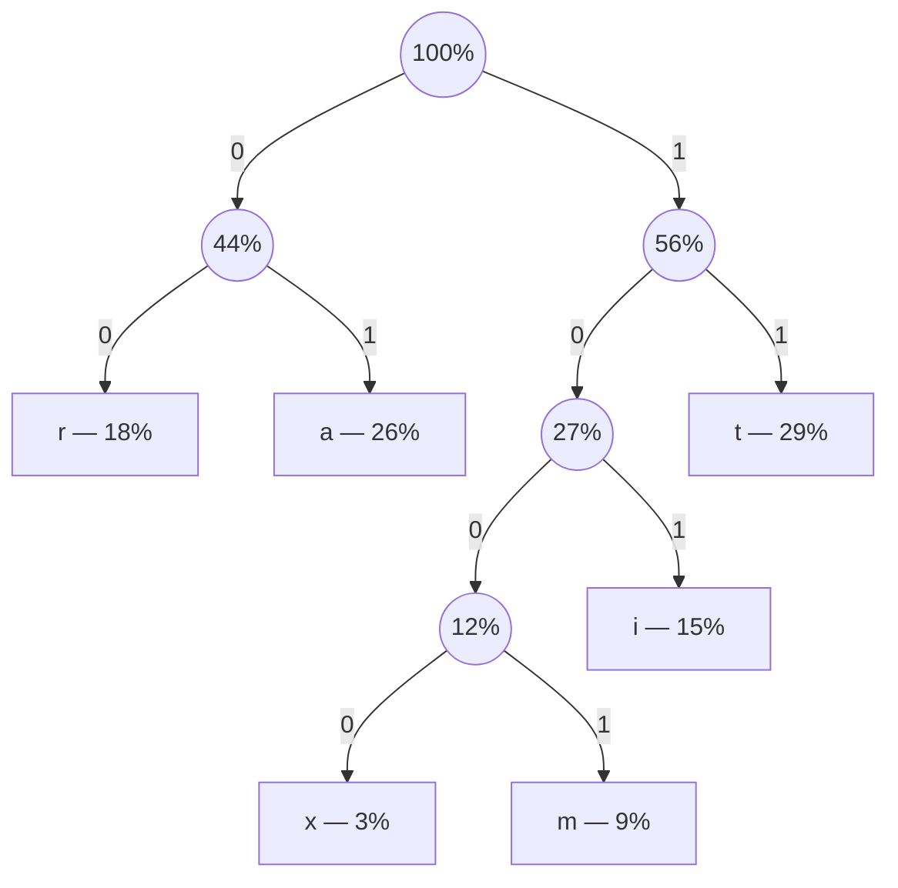

# Übungsblatt 9

TODO

---

1.

TODO

2.

```
0011 0110 0011 001 00 010 000
a    m    a    z   i  n   g
```

---

3.

Codebaum:



Decoded:

```
1001 01 11 00 101 1000
m    a  t  r  i   x
```

Entropie/Redundanz:

| $a_k$                 | a    | i    | m    | r     | t    | x     |
| --------------------- | ---- | ---- | ---- | ----- | ---- | ----- |
| $P(a_k)$              | 26%  | 15%  | 9%   | 18%   | 29%  | 3%    |
| Bitlänge              | 2    | 3    | 4    | 2     | 2    | 4     |
| $H(a_k)$              | 1.94 | 2.74 | 3.47 | 2.47  | 1.79 | 5.06  |
| $P(a_k) \cdot H(a_k)$ | 0.51 | 0.41 | 0.31 | 0.45  | 0.52 | 0.15  |
| Redundanz             | 0.06 | 0.26 | 0.53 | -0.47 | 0.21 | -1.06 |

Entropie der Quelle: $H(Q) = 2.35$

Maximale Entopie: $2.58$

Redundanz: $2.58 - 2.35 = 0.23$

---

4.

| Eingabe | Dekodierte Ausgabe | Neuer Wörterbucheintrag |
| ------- | ------------------ | ----------------------- |
| $U$     | `U`                | –                       |
| $w_1$   | `UU`               | $w_1=\text{UU}$         |
| $Y$     | `Y`                | $w_2=\text{UUY}$        |
| $O$     | `O`                | $w_3=\text{YO}$         |
| $N$     | `N`                | $w_4=\text{ON}$         |
| $E$     | `E`                | $w_5=\text{NE}$         |
| $R$     | `R`                | $w_6=\text{ER}$         |
| $w_5$   | `NE`               | $w_7=\text{RN}$         |
| $V$     | `V`                | $w_8=\text{NEV}$        |
| $w_6$   | `ER`               | $w_9=\text{VE}$         |
| $G$     | `G`                | $w_{10}=\text{ERG}$     |
| $w_4$   | `ON`               | $w_{11}=\text{GO}$      |
| $N$     | `N`                | $w_{12}=\text{ONN}$     |
| $A$     | `A`                | $w_{13}=\text{NA}$      |
| $G$     | `G`                | $w_{14}=\text{AG}$      |
| $I$     | `I`                | $w_{15}=\text{GI}$      |
| $w_9$   | `VE`               | $w_{16}=\text{IV}$      |
| $w_3$   | `YO`               | $w_{17}=\text{VEY}$     |
| $w_1$   | `UU`               | $w_{18}=\text{YOU}$     |
| $P$     | `P`                | $w_{19}=\text{UUP}$     |

```
UUU YONER NEVER GONNA GIVE YOU UP
```

5.

TODO