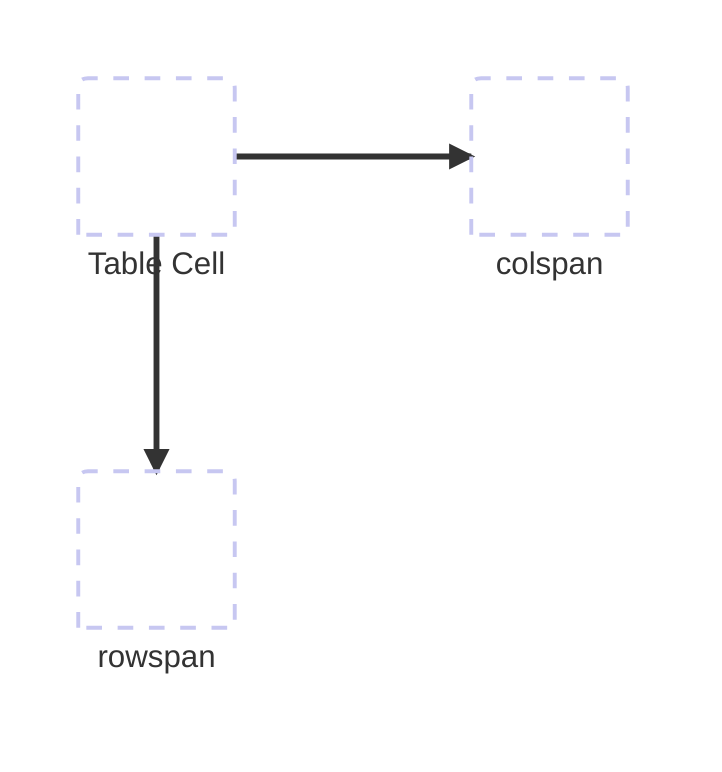

# Material

[Webengineering I - 1 HTML.pdf](/external/Webengineering%20I%20-%201%20HTML.pdf)

## Tabellen

- `table` Grundelement für Tabellen
- `tr` Tabellenzeile
- `td` Tabellenzelle
- `th` Tabellenüberschrift (fett)
- `thead` Tabellenkopfbereich
- `tbody` Tabelleninhaltsbereich
- `tfoot` TabellenFußzeile
- `caption` Überschrift über der Tabelle

Beispiel

```html
<table>
    <caption>Überschrift</caption>
    <thead>
        <tr>
            <th>Überschrift 1</th>
            <th>Überschrift 2</th>
            <th>Überschrift 2</th>
        </tr>
    </thead>
    <tbody>
        <tr>
            <td>Feld 1-1</td>
            <td>Feld 1-2</td>
            <td>Feld 1-3</td>
        </tr>
        <tr>
            <td>Feld 2-1</td>
            <td>Feld 2-2</td>
            <td>Feld 2-3</td>
        </tr>
        <tr>
            <td>Feld 3-1</td>
            <td>Feld 3-2</td>
            <td>Feld 3-3</td>
        </tr>
    </tbody>
    <tfoot>
        <tr>
            <td>Footer 1</td>
            <td>Footer 2</td>
            <td>Footer 3</td>
        </tr>
    </tfoot>
</table>
```

Um aus diesem Raster auszubrechen kann man den `td` oder `th` mit folgenden Attributen versehen:

- `colspan`: Spalten zusammenfassen
- `rowspan`: Zeilen zusammenfassen



## Links

Links erstellt man mit dem `a` (Anchor) Element.

Das Ziel vom Link gibt man mit dem Attribut `href` an.

Beispiel

```html
<a href="https://www.google.com">Link Text</a>
```

Weitere Attribute:

- `target` (Ziel): `_blank` (Neues Fenster), `_self` (Neues Fenster)
- `download`: Dateinamen zum downloaden
- `rel`: Verweisart, z.B. `alternate`, `help` ..
- `type`: MIME type

## Bilder

Für Bilder kann man u.a. den `img` Tag verwenden. Attribute:

- `src`: Bildquelle
- `alt`: Alternative Beschreibung
- `width`: Festgelegte Breite
- `height`: Festgelegte Höhe

## Praxisaufgaben

[Tabellen](./tables.html)

Verweise:

- [A](./references/A.html)
- [B](./references/B.html)
- [C](./references/C.html)
- [D](./references/D.html)